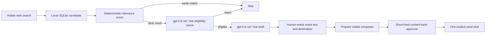

[English](README.md) · [العربية](i18n/README.ar.md) · [Español](i18n/README.es.md) · [Français](i18n/README.fr.md) · [日本語](i18n/README.ja.md) · [한국어](i18n/README.ko.md) · [Tiếng Việt](i18n/README.vi.md) · [中文 (简体)](i18n/README.zh-Hans.md) · [中文（繁體）](i18n/README.zh-Hant.md) · [Deutsch](i18n/README.de.md) · [Русский](i18n/README.ru.md)

[](https://github.com/lachlanchen/lachlanchen/blob/main/figs/banner.png)

# LazyPromotion

*Find a real need, write a useful answer, disclose your connection, and let a human decide whether to send it.*

[](https://www.python.org/)
[](https://playwright.dev/python/)
[](https://developers.openai.com/api/docs/models/gpt-5.6-sol)
[](LICENSE)
[](https://github.com/sponsors/lachlanchen)

LazyPromotion is a local, review-first social discovery assistant. It searches
the real Reddit, X, Instagram, or Hacker News web interface in one visible persistent Chrome
profile, records possible matches in SQLite, drafts one grounded reply with
`gpt-5.6-sol` at low reasoning effort, and stops before the public send. It is
for maintainers who want to help people with relevant open-source work without
turning community conversations into bulk marketing.

| Donate | PayPal | Stripe |
| --- | --- | --- |
| [](https://chat.lazying.art/donate) | [](https://paypal.me/RongzhouChen) | [](https://buy.stripe.com/aFadR8gIaflgfQV6T4fw400) |

## The operating contract



- Helpful first: a reply must address the person's concrete need before a
  project is mentioned.
- Honest affiliation: project links use plain disclosure such as “I maintain…”
  or “I built…”.
- One person, one decision: no mass replies, unsolicited DMs, automated votes,
  follows, or engagement loops.
- Cross-post aware: exact long-form copies by the same author collapse behind
  one canonical candidate, preferring the copy that already received a reply.
- Fresh by default: source timestamps and discussion counts are recorded, and
  posts older than 30 days are marked stale and refused by the drafter.
- Comment-aware intent: replies must contain a direct request phrase; rhetorical
  questions, advice, service pitches, and engagement calls are filtered first.
- Ambiguity-aware matching: a catalog keyword may declare required technical
  context; for example, `local RAG` must occur with an LLM, retrieval, document,
  PDF, embedding, vector-database, or knowledge-base signal so the newspaper
  idiom “local rag” is not treated as product demand.
- Evidence-gated routes: high-intent searches can require separate ownership,
  task, and privacy/local signal groups in the hydrated body. Search-engine
  Boolean leakage therefore cannot spend model quota on unrelated results, and
  self-announced tools are excluded unless the author states a direct unresolved
  request.
- Exact approval: changing the draft invalidates its short-lived approval.
- Exact delivery: Reddit records the matching comment thing IDs before the
  public click and accepts only a new exact-body ID afterward, for both
  top-level post comments and replies bound to a specific parent comment.
- Visible operation: Chrome runs in noVNC and important steps capture local,
  ignored screenshots.
- Private sessions stay private: credentials, cookies, profiles, candidates,
  drafts, approvals, and runtime evidence never enter Git.

## Current contents

| Path | Purpose |
| --- | --- |
| [`promotion.py`](promotion.py) | SQLite ledger, project matching, Codex drafting, and hash-bound approvals |
| [`browser.py`](browser.py) | Playwright/CDP discovery, inspection, composer preparation, and gated send |
| [`worker.py`](worker.py) | Durable cooldown-based discovery, triage, drafting, and private review queue |
| [`catalog.json`](catalog.json) | Grounded mapping from real needs to maintained open-source projects |
| [`github-repos.json`](github-repos.json) | Public-only inventory of every `lachlanchen` source repository |
| [`docs/portfolio-inventory.md`](docs/portfolio-inventory.md) | Human-readable map of all public work, grouped by real problem area and honest conversion path |
| [`inventory.py`](inventory.py) | Deterministically regenerates the public portfolio map from the GitHub index |
| [`sync_github_catalog.py`](sync_github_catalog.py) | Deterministic catalog refresh through the open-source GitHub CLI |
| [`discovery-plan.json`](discovery-plan.json) | Bounded help-request searches plus reviewed need-oriented topic overrides for ambiguous repository metadata |
| [`campaigns/`](campaigns/) | Evidence-backed, channel-specific campaign sources with no credentials or private integration IDs |
| [`docs/first-1000.md`](docs/first-1000.md) | One repeatable USD 250 LKT collection-fit sprint and its truthful four-sale milestone |
| [`docs/conversion.md`](docs/conversion.md) | Value-first path from qualified attention to confirmed leads and gross revenue |
| [`metrics.py`](metrics.py) | Private, evidence-gated funnel and confirmed gross-revenue ledger, including received affiliate commission and reversals |
| [`affiliate-programs.json`](affiliate-programs.json) | Public, priority-ordered affiliate candidates matched to exact LazyingArt assets, official evidence, disclosures, prohibited actions, and fail-closed gates |
| [`affiliate.py`](affiliate.py) | Sanitized application packets and explicit, secret-suppressing readiness checks over ignored private link records |
| [`docs/affiliate-portfolio.md`](docs/affiliate-portfolio.md) | Contextual affiliate execution order, operator checklist, revenue semantics, holds, and revalidation contract |
| [`blog_editorial.py`](blog_editorial.py) | Static count, identity, language, Markdown-structure, and manifest checks for the LazyBlog editorial ledger and four-file post bundles |
| [`owned_monitor.py`](owned_monitor.py) | Read-only Postiz publication/engagement monitor that requires visible release verification, creates review alerts, stores no raw provider IDs, and never calls engagement a lead |
| [`inbound_monitor.py`](inbound_monitor.py) | Read-only iCloud intake monitor that records only the dedicated LKT folder's aggregate counts and never opens or persists mail content |
| [`payment_readiness.py`](payment_readiness.py) | Read-only, secret-sanitized validation of the fixed USD 250 LKT Stripe path |
| [`lkt_delivery.py`](lkt_delivery.py) | Deterministic metadata-only LKT sprint preflight and truth-safe Markdown delivery-packet renderer |
| [`docs/lkt-delivery.md`](docs/lkt-delivery.md) | Sanitized intake contract, go/no-go behavior, and customer-data-free delivery workflow |
| [`signals.py`](signals.py) | Private first-party demand signals kept distinct from leads, orders, and revenue |
| [`docs/voice.md`](docs/voice.md) | Quiet, human maintainer voice that lets useful replies and the profile do the promotion |
| [`network.py`](network.py) | Evidence graph connecting needs, projects, repositories, channels, campaigns, drafts, and public proof |
| [`promotion-network.public.json`](promotion-network.public.json) | Sanitized online graph of public projects, repositories, campaigns, channels, and evidence URLs |
| [`scripts/desktop.sh`](scripts/desktop.sh) | One project-owned Xvfb/x11vnc/noVNC/Chrome stack with a persistent profile |
| [`schemas/reply.json`](schemas/reply.json) | Bounded structured output contract for reply drafts |
| [`schemas/triage.json`](schemas/triage.json) | Structured model eligibility decision required before a reply draft |
| [`docs/open-source-evaluation.md`](docs/open-source-evaluation.md) | Review of Postiz, Mixpost, Postmill, SocialCrabs, Steadfast, and Playwright |
| [`scripts/postiz-codex.sh`](scripts/postiz-codex.sh) | Operator-only launcher for the official Postiz MCP using the CLI's private OAuth store |
| [`.codex/config.toml`](.codex/config.toml) | Optional pinned Playwright and review-gated Postiz MCP attachments |
| [`docs/mcp-browser.md`](docs/mcp-browser.md) | MCP setup, trust boundary, verification, and direct-controller fallback |
| [`docs/postiz.md`](docs/postiz.md) | Official CLI/MCP setup, quota policy, and draft-first operating contract |
| [`docs/postiz-affiliate.md`](docs/postiz-affiliate.md) | Zero-baseline Postiz affiliate experiment, disclosures, evidence gates, funnel metrics, and stop rules |
| [`tests/`](tests/) | Matching, idempotency, and exact-content approval tests |

The initial catalog includes LazyEdit, AutoPublication, PocketPolyglot,
LinguaLeaf, LazyLearn, the Leonard Susskind notes archive, Musia,
LocalVideoGen, vocabulary and word-origin tools, LazyEarn, How You Got Rich,
LocalKnowledgeTerminal, LazyGame, and LazyWeiqi.

The public GitHub index expands that curated set to every evidence-backed
source repository under `lachlanchen`. Generated matches require either a
multiword topic or two distinct topic hits; curated matches retain priority.
Repositories without a public description or usable topics remain indexed but
are not suggested until evidence is added.

## Quick start

Prerequisites: Linux, Python 3.10+, Chrome, Playwright for Python, Xvfb,
x11vnc, noVNC/websockify, `tmux`, and an authenticated Codex CLI for drafting.

```bash
git clone https://github.com/lachlanchen/LazyPromotion.git
cd LazyPromotion
python -m pip install -r requirements.txt
python promotion.py init
scripts/desktop.sh start
python browser.py status
```

Open the printed noVNC URL, sign in manually, and keep credentials inside the
ignored project profile. Run a narrow, need-oriented discovery pass:

```bash
python browser.py search \
  --platform reddit \
  --query 'need help add subtitles to video' \
  --limit 12 \
  --hydrate 5 \
  --background

python promotion.py list --min-score 5
python browser.py inspect CANDIDATE_ID
python promotion.py triage CANDIDATE_ID
python promotion.py draft CANDIDATE_ID
```

If newly reviewed project evidence materially improves an unsent draft, create
a replacement with `python promotion.py redraft CANDIDATE_ID`. The older draft
is marked superseded and any approval bound to it becomes unusable.

When community rules or the account's contribution history make another
project mention inappropriate, use `python promotion.py redraft CANDIDATE_ID
--value-only`. That mode still uses reviewed context to avoid bad advice, but
fails closed if the result names the project or affiliation, contains a URL, or
sets `include_link=true`. It is a trust-building answer, not a disguised pitch.

When a community also requires a specific disclosure, bind it to generation
and validation instead of adding it after review:

```bash
python promotion.py redraft CANDIDATE_ID --value-only \
  --required-prefix 'AI-assisted recommendation; I checked the current docs before posting.'
```

The command fails if the generated reply does not begin with the exact reviewed
prefix, so the stored content hash and later approval cover the disclosure too.

For a bounded read-only model check over the current eligible queue:

```bash
python promotion.py triage-pending --limit 5
```

Or run a finite set of project-specific Reddit searches from the reviewed plan:

```bash
python browser.py cycle \
  --platform reddit \
  --max-queries 5 \
  --limit-per-query 12 \
  --hydrate-per-query 3 \
  --background
```

The same bounded cycle supports `reddit`, `x`, `hackernews`, and `instagram`.
Each Reddit route checks posts and comments, while each Hacker News route checks
Ask HN stories and discussion comments. Comment permalinks are hydrated and
remain the exact research destination. Hacker News is discovery-only: its
guidelines prohibit generated or AI-edited comments, and LazyPromotion blocks
drafting, approval, preparation, and sending there.
It only searches, records, and inspects candidates; it cannot draft, approve,
or send a reply. Instagram uses a small reviewed hashtag set, inspects both
captions and exact-permalink comments, and still requires an explicit help
request before model triage. A comment draft keeps the reviewed `@username`
target and the per-comment Reply action is revalidated before preparation.

For continuous operation, start the durable worker:

```bash
scripts/worker.sh start \
  --interval-minutes 60 \
  --core-queries-per-platform 1 \
  --queries-per-platform 1 \
  --max-triage 3 \
  --max-drafts 1

scripts/worker.sh status
```

Each cycle runs one reviewed core route. Distinct high-intent LKT searches for
private documents, offline retrieval, lightweight RAG, and multilingual
knowledge recur in at least one of every five core slots, while subtitle,
language-learning, physics, and local-media routes remain in rotation. One
independently rotating long-tail route still covers every evidence-backed
repository on Reddit, X, and Hacker
News without increasing the configured per-cycle query or model budget. HN
results inform product research but never enter the generated-comment queue.
Instagram rotates its small reviewed
explicit-help hashtag set. Failed routes keep their own lane cursor for retry.
State,
logs, candidates, model decisions, screenshots, and the exact draft review
queue live under ignored `.local/` paths. Instagram portfolio and promotional
posts or comments are discarded unless their own text contains an explicit
request.
Any remaining triage capacity drains only the freshest timestamped requests
that previously passed a reviewed route. A durable admission marker lets a
transient model failure retry without allowing filtered search noise into the
model backlog.
Continuous mode never approves,
submits, votes, follows, or sends a direct message.
It also generates Reddit drafts in value-only mode by default. A project mention
requires an explicit normal redraft after reviewing the live community rules,
the account's contribution history, and the exact destination. Direct
first-party X and Instagram campaign posts remain separate from this safeguard.

The triage model receives reviewed per-project offer context as well as the
repository summary. This matters for LKT: it may identify a request for a
bounded collection-fit assessment, but it must not claim that the repository is
an off-the-shelf RAG application. The resulting reply still has to answer the
technical question before any disclosed fit-check mention.

Refresh the public repository inventory at any time:

```bash
python sync_github_catalog.py
python inventory.py
```

Refresh the private evidence graph and its sanitized public projection:

```bash
python network.py sync --workspace
python network.py report
python network.py export-public
```

Triage and drafting explicitly disable browser MCP access. Those model calls
can classify or write local structured output only; they cannot navigate,
click, or publish.

Verify the downstream LKT payment path without creating any Stripe object:

```bash
python payment_readiness.py

python payment_readiness.py \
  --check-account \
  --confirm-private-financial-read
```

The first command validates the sibling Stripe helper's fixed USD 250 config,
review checklist, private key file permissions, and key mode without network
access. The second performs one read-only Stripe account lookup and prints only
readiness booleans—never the key or account identifier. Neither command creates
a Product, Price, Payment Link, charge, or payout. A real fit check and accepted
written scope remain mandatory before the separately guarded creation command.

Prepare a reviewed draft without sending it:

```bash
python browser.py prepare CANDIDATE_ID DRAFT_ID
```

Only after a human reviews the exact destination and visible composer:

```bash
python promotion.py approve DRAFT_ID \
  --ttl-minutes 30 \
  --confirm-reviewed-exact-content

python browser.py send CANDIDATE_ID DRAFT_ID \
  --approval-token APPROVAL_TOKEN \
  --confirm-public-write
```

For Reddit comment replies, the send path binds both the composer and submit
button to the reviewed parent comment ID. It marks delivery only after the
exact reply appears in a real child-comment body; text still sitting in a
composer cannot satisfy the check. If a platform click has an ambiguous result,
inspect the destination before retrying. A confirmed false acknowledgement can
be reopened without erasing its event history or reusing its approval:

```bash
python promotion.py reopen-unverified-send DRAFT_ID \
  --reason 'The reviewed destination shows no public reply.' \
  --evidence '.local/evidence/POST_CLICK_SCREENSHOT.png' \
  --confirm-no-public-reply-observed
```

## Runtime isolation

The default launcher uses one 3840×1080 display (`:116`) with two non-overlapping
1920×1080 Chrome lanes that share one persistent profile. noVNC `6138` exports
the campaign lane, `6137` exports the affiliate lane, and `6136` provides the
full-width overview; VNC uses `5938`, `5937`, and `5936` respectively. CDP stays
on `127.0.0.1:9436` and the tmux session is `lazypromotion-browser`. All services
bind to loopback. The launcher refuses unknown occupied ports and removes only
a stale display lock that matches its own recorded Xvfb PID. It restores one
small campaign/intake workspace and one small affiliate-review workspace,
records their exact window IDs, and continuously pins those IDs to their named
lanes so focus changes cannot swap the views or expose obscured black blocks.

The continuous worker and every `browser.py` command also share one filesystem
operation lock. A manual inspection, composer review, or send therefore waits
for an active discovery pass to release the platform tabs instead of racing it
on the same CDP page.

Reuse the one project-owned desktop during review, then stop it when nobody is
waiting:

```bash
scripts/desktop.sh status
scripts/desktop.sh stop
```

## Open-source baseline

The first release intentionally uses vanilla Playwright and SQLite instead of
a large scheduler or anti-detection framework. Postiz and Mixpost are useful
for planned campaigns; SocialCrabs and Steadfast contain broader engagement and
evasion features that do not belong in this review-first loop. See the
[full evaluation](docs/open-source-evaluation.md).

For agents that speak MCP, the repository also provides an optional, pinned
[Playwright MCP attachment](docs/mcp-browser.md). It reuses the same Chrome CDP
endpoint, disables browser close/install tools, prompts for browser mutations,
and leaves `browser.py` as the guarded public-send path.

The official Postiz CLI and remote MCP are available through the
[operator integration](docs/postiz.md). The OAuth credential stays in Postiz's
private CLI store, model subprocesses cannot access the scheduler, and Postiz
AI media tools remain disabled to preserve paid quota.

The design follows Reddit's current requirements that user actions be explicit
and separate, and that repeated unsolicited engagement is spam even when done
manually. Platform rules and the exact community rules must still be reviewed
before every public reply.

## Validation

```bash
python -m unittest discover -s tests -v
python -m py_compile promotion.py browser.py worker.py network.py inventory.py metrics.py signals.py blog_editorial.py
python blog_editorial.py ledger docs/blog-editorial-ledger.md
python blog_editorial.py post ../BLOG POST_ID
bash -n scripts/desktop.sh
git diff --check
```

The editorial checker is intentionally local and static. Passing it does not
prove that an article is accurate, safe, live, or pushed; the six evidence
gates in the [editorial ledger](docs/blog-editorial-ledger.md) still apply.

## Citation

If you use LazyPromotion in research, cite the repository. GitHub reads
[CITATION.cff](CITATION.cff) and shows a **Cite this repository** panel on the
repo page.

```bibtex
@software{chen_lazypromotion_2026,
  author = {Chen, Lachlan},
  title = {LazyPromotion: Review-First Social Discovery and Reply Assistance},
  year = {2026},
  url = {https://github.com/lachlanchen/LazyPromotion}
}
```

## Status and scope

This is an early Linux-first release. Third-party selectors can change and
must be maintained. Discovery and drafting are assistance tools, not evidence
that a reply should be posted. The human operator remains responsible for
accuracy, community fit, platform terms, disclosure, and the final send.
