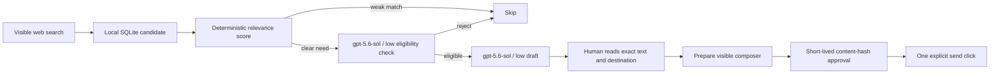

[English](README.md) · [العربية](i18n/README.ar.md) · [Español](i18n/README.es.md) · [Français](i18n/README.fr.md) · [日本語](i18n/README.ja.md) · [한국어](i18n/README.ko.md) · [Tiếng Việt](i18n/README.vi.md) · [中文 (简体)](i18n/README.zh-Hans.md) · [中文（繁體）](i18n/README.zh-Hant.md) · [Deutsch](i18n/README.de.md) · [Русский](i18n/README.ru.md)

[](https://github.com/lachlanchen/lachlanchen/blob/main/figs/banner.png)

# LazyPromotion

*Find a real need, write a useful answer, disclose your connection, and let a human decide whether to send it.*

[](https://www.python.org/)
[](https://playwright.dev/python/)
[](https://developers.openai.com/api/docs/models/gpt-5.6-sol)
[](LICENSE)
[](https://github.com/sponsors/lachlanchen)

LazyPromotion is a local, review-first social discovery assistant. It searches
the real Reddit, X, Instagram, or Hacker News web interface in one visible persistent Chrome
profile, records possible matches in SQLite, drafts one grounded reply with
`gpt-5.6-sol` at low reasoning effort, and stops before the public send. It is
for maintainers who want to help people with relevant open-source work without
turning community conversations into bulk marketing.

| Donate | PayPal | Stripe |
| --- | --- | --- |
| [](https://chat.lazying.art/donate) | [](https://paypal.me/RongzhouChen) | [](https://buy.stripe.com/aFadR8gIaflgfQV6T4fw400) |

## The operating contract



- Helpful first: a reply must address the person's concrete need before a
  project is mentioned.
- Honest affiliation: project links use plain disclosure such as “I maintain…”
  or “I built…”.
- One person, one decision: no mass replies, unsolicited DMs, automated votes,
  follows, or engagement loops.
- Cross-post aware: exact long-form copies by the same author collapse behind
  one canonical candidate, preferring the copy that already received a reply.
- Fresh by default: source timestamps and discussion counts are recorded, and
  posts older than 30 days are marked stale and refused by the drafter.
- Exact approval: changing the draft invalidates its short-lived approval.
- Visible operation: Chrome runs in noVNC and important steps capture local,
  ignored screenshots.
- Private sessions stay private: credentials, cookies, profiles, candidates,
  drafts, approvals, and runtime evidence never enter Git.

## Current contents

| Path | Purpose |
| --- | --- |
| [`promotion.py`](promotion.py) | SQLite ledger, project matching, Codex drafting, and hash-bound approvals |
| [`browser.py`](browser.py) | Playwright/CDP discovery, inspection, composer preparation, and gated send |
| [`worker.py`](worker.py) | Durable cooldown-based discovery, triage, drafting, and private review queue |
| [`catalog.json`](catalog.json) | Grounded mapping from real needs to maintained open-source projects |
| [`github-repos.json`](github-repos.json) | Public-only inventory of every `lachlanchen` source repository |
| [`sync_github_catalog.py`](sync_github_catalog.py) | Deterministic catalog refresh through the open-source GitHub CLI |
| [`discovery-plan.json`](discovery-plan.json) | Bounded, project-specific help-request searches for each supported platform |
| [`scripts/desktop.sh`](scripts/desktop.sh) | One project-owned Xvfb/x11vnc/noVNC/Chrome stack with a persistent profile |
| [`schemas/reply.json`](schemas/reply.json) | Bounded structured output contract for reply drafts |
| [`schemas/triage.json`](schemas/triage.json) | Structured model eligibility decision required before a reply draft |
| [`docs/open-source-evaluation.md`](docs/open-source-evaluation.md) | Review of Postiz, Mixpost, Postmill, SocialCrabs, Steadfast, and Playwright |
| [`.codex/config.toml`](.codex/config.toml) | Optional pinned Playwright MCP attachment to the same CDP browser |
| [`docs/mcp-browser.md`](docs/mcp-browser.md) | MCP setup, trust boundary, verification, and direct-controller fallback |
| [`tests/`](tests/) | Matching, idempotency, and exact-content approval tests |

The initial catalog includes LazyEdit, AutoPublication, PocketPolyglot,
LinguaLeaf, LazyLearn, the Leonard Susskind notes archive, Musia,
LocalVideoGen, vocabulary and word-origin tools, LazyEarn, How You Got Rich,
LocalKnowledgeTerminal, LazyGame, and LazyWeiqi.

The public GitHub index expands that curated set to every evidence-backed
source repository under `lachlanchen`. Generated matches require either a
multiword topic or two distinct topic hits; curated matches retain priority.
Repositories without a public description or usable topics remain indexed but
are not suggested until evidence is added.

## Quick start

Prerequisites: Linux, Python 3.10+, Chrome, Playwright for Python, Xvfb,
x11vnc, noVNC/websockify, `tmux`, and an authenticated Codex CLI for drafting.

```bash
git clone https://github.com/lachlanchen/LazyPromotion.git
cd LazyPromotion
python -m pip install -r requirements.txt
python promotion.py init
scripts/desktop.sh start
python browser.py status
```

Open the printed noVNC URL, sign in manually, and keep credentials inside the
ignored project profile. Run a narrow, need-oriented discovery pass:

```bash
python browser.py search \
  --platform reddit \
  --query 'need help add subtitles to video' \
  --limit 12 \
  --hydrate 5 \
  --background

python promotion.py list --min-score 5
python browser.py inspect CANDIDATE_ID
python promotion.py triage CANDIDATE_ID
python promotion.py draft CANDIDATE_ID
```

If newly reviewed project evidence materially improves an unsent draft, create
a replacement with `python promotion.py redraft CANDIDATE_ID`. The older draft
is marked superseded and any approval bound to it becomes unusable.

For a bounded read-only model check over the current eligible queue:

```bash
python promotion.py triage-pending --limit 5
```

Or run a finite set of project-specific Reddit searches from the reviewed plan:

```bash
python browser.py cycle \
  --platform reddit \
  --max-queries 5 \
  --limit-per-query 12 \
  --hydrate-per-query 3 \
  --background
```

The same bounded cycle supports `reddit`, `x`, `hackernews`, and `instagram`.
It only searches, records, and inspects candidates; it cannot draft, approve,
or send a reply. Instagram uses a small reviewed hashtag set and still requires
an explicit help request in the caption before model triage.

For continuous operation, start the durable worker:

```bash
scripts/worker.sh start \
  --interval-minutes 60 \
  --queries-per-platform 1 \
  --max-triage 3 \
  --max-drafts 1

scripts/worker.sh status
```

Each cycle rotates its cursor through all evidence-backed repositories on
Reddit, X, and Hacker News, plus a small explicit-help hashtag set on Instagram,
rather than repeating the first searches. State,
logs, candidates, model decisions, screenshots, and the exact draft review
queue live under ignored `.local/` paths. Instagram portfolio and promotional
posts are discarded unless the caption contains an explicit request.
Any remaining triage capacity drains the freshest timestamped request backlog,
so a transient model failure cannot strand a genuine need indefinitely.
Continuous mode never approves,
submits, votes, follows, or sends a direct message.

Refresh the public repository inventory at any time:

```bash
python sync_github_catalog.py
```

Triage and drafting explicitly disable browser MCP access. Those model calls
can classify or write local structured output only; they cannot navigate,
click, or publish.

Prepare a reviewed draft without sending it:

```bash
python browser.py prepare CANDIDATE_ID DRAFT_ID
```

Only after a human reviews the exact destination and visible composer:

```bash
python promotion.py approve DRAFT_ID \
  --ttl-minutes 30 \
  --confirm-reviewed-exact-content

python browser.py send CANDIDATE_ID DRAFT_ID \
  --approval-token APPROVAL_TOKEN \
  --confirm-public-write
```

## Runtime isolation

The default launcher uses display `:116`, VNC `127.0.0.1:5936`, noVNC
`127.0.0.1:6136`, CDP `127.0.0.1:9436`, and the tmux session
`lazypromotion-browser`. All services bind to loopback. The launcher refuses
unknown occupied ports and removes only a stale display lock that matches its
own recorded Xvfb PID.

Reuse the one project-owned desktop during review, then stop it when nobody is
waiting:

```bash
scripts/desktop.sh status
scripts/desktop.sh stop
```

## Open-source baseline

The first release intentionally uses vanilla Playwright and SQLite instead of
a large scheduler or anti-detection framework. Postiz and Mixpost are useful
for planned campaigns; SocialCrabs and Steadfast contain broader engagement and
evasion features that do not belong in this review-first loop. See the
[full evaluation](docs/open-source-evaluation.md).

For agents that speak MCP, the repository also provides an optional, pinned
[Playwright MCP attachment](docs/mcp-browser.md). It reuses the same Chrome CDP
endpoint, disables browser close/install tools, prompts for browser mutations,
and leaves `browser.py` as the guarded public-send path.

The design follows Reddit's current requirements that user actions be explicit
and separate, and that repeated unsolicited engagement is spam even when done
manually. Platform rules and the exact community rules must still be reviewed
before every public reply.

## Validation

```bash
python -m unittest discover -s tests -v
python -m py_compile promotion.py browser.py
bash -n scripts/desktop.sh
git diff --check
```

## Citation

If you use LazyPromotion in research, cite the repository. GitHub reads
[CITATION.cff](CITATION.cff) and shows a **Cite this repository** panel on the
repo page.

```bibtex
@software{chen_lazypromotion_2026,
  author = {Chen, Lachlan},
  title = {LazyPromotion: Review-First Social Discovery and Reply Assistance},
  year = {2026},
  url = {https://github.com/lachlanchen/LazyPromotion}
}
```

## Status and scope

This is an early Linux-first release. Third-party selectors can change and
must be maintained. Discovery and drafting are assistance tools, not evidence
that a reply should be posted. The human operator remains responsible for
accuracy, community fit, platform terms, disclosure, and the final send.
