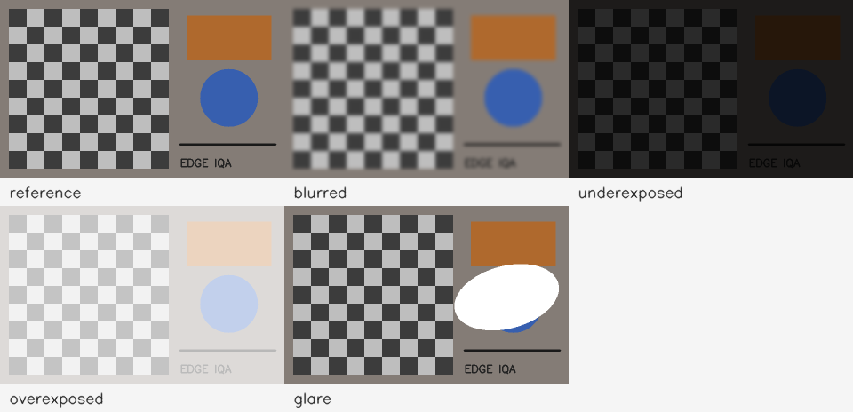

# Interpretable edge image-quality baseline

This executed sample shows the smallest honest starting point for blur,
exposure, clipping, and large low-saturation highlight checks on a CPU. It is
targeted evidence for a current buyer need, not a claim that generic thresholds
can validate medical imagery.



Run the deterministic fixture build and packet check:

```bash
python build.py
python build.py --check
```

Assess one PNG or JPEG:

```bash
python iqa.py image.png
```

Run the reference API locally:

```bash
uvicorn api:app --host 127.0.0.1 --port 8000
curl --data-binary @image.png -H 'Content-Type: image/png' \
  http://127.0.0.1:8000/assess
```

The API accepts raw PNG/JPEG bodies, rejects other content types, caps the
example request at 12 MiB, and returns PASS/FAIL, reason codes, measurements,
thresholds, and image dimensions. The Dockerfile runs the same API without a
GPU and without root privileges.

The checked packet under `artifacts/` contains five project-owned synthetic
fixtures, per-fixture JSON results, the workstation benchmark, report, and
SHA-256 manifest. Incorrect-view detection is deliberately absent: the views
and acceptance rules must first be defined from representative labelled domain
images. Nothing here is clinical, diagnostic, regulatory, customer, or accuracy
evidence.
